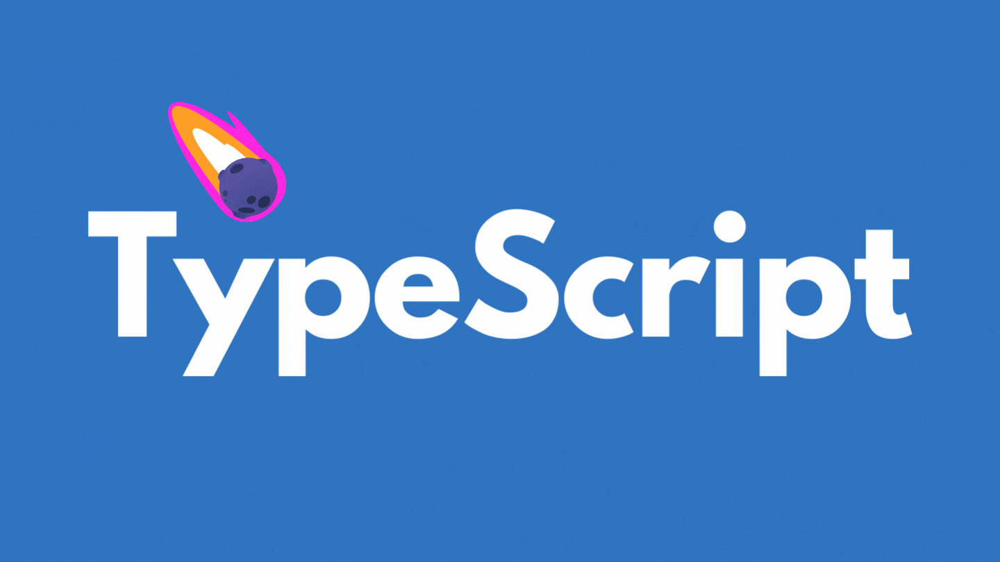

# TypeScript  Course 👨‍🏫

## what is type script 🤔
TypeScript is a programming language developed by Microsoft. 
It's an open-source language that builds on top of JavaScript by adding static type definitions. 
This means that TypeScript allows developers to write JavaScript code with the added benefit of static typing, 
which can help catch errors early in the development process and make code easier to understand and maintain.
